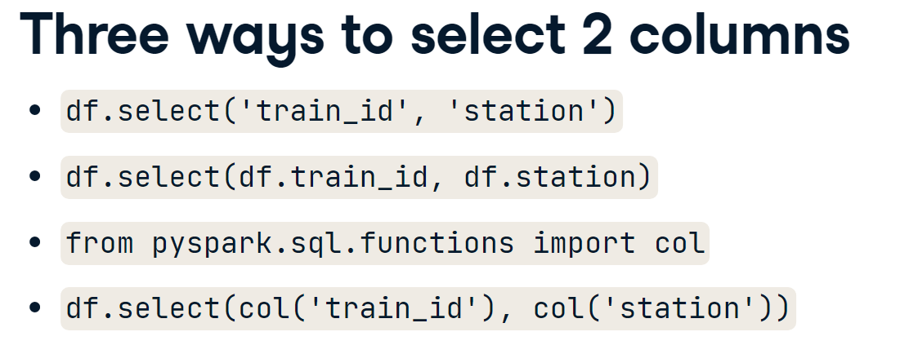

# Let's start
il faudra comprendre comment marche la formula1
il y un site ergast.com/mrd pour avoir les données

## Project Requirements
- *Data Ingestion requirements:*
  - Ingest all 8 files into the data lake
  - Ingested deta must have the schema applied
  - Ingested data must have audit columns
  - Ingested data must be sored in columnar format (i.e. Parquet)
  - Must be able to analyze the ingested data via SQL
  - Ingestion logic must be able to handle incremental load
- *Data Transformation requirements:*
  - Join the key information required for reportinf to create a new table
  - Join the key information requiredfor analysis to create a new table
  - Transformed tables must have audit columns
  - must be able to analyze the transformed data via SQL
  - Transformed data must be stored in columnar format (i.e. Parquet)
  - Transformation logic must be able to handle incremental load
- *Reporting requirements:*
  - Driver Standings
  - Constructor Standings
- *Analysis requirements:*
  - Dominant Drivers
  - Dominant Teams
  - Visualize the outputs
  - Create databricks Dashboards
- *Scheduling requirements:*
  - Scheduled to run every Sundat at 10pm (22h)
  - Ablity to monitor pipelines
  - Ablity to re-run failed pipelines
  - ABility to set-up alerts on failures
- *Other Non-Functional requirements:*
  - Ability to delete individual records
  - Ability to see history and tome travel
  - Ability to roll back to a previous version

## Solution Architecture Overview

ergast API -> Adls Raw layer -> Ingest with databricks -> ADLS ingested layer -> Transform with databricks -> adls presentation layer -> Analyze with databricks -> Dashboards

We'll use azure data factory to implement the desired result

il faut prendre en considération que l'architecture peu varier d'une personne à une autre et cela selon le concept et la vision de la personne


il y a aussi: https://docs.microsoft.com/en-us/azure/architecture/
par exemple 


## CSV data Ingestion

- Ingest all 8 files into the data lake
- Ingested data must have the schema applied
- Ingested data must have audit columns
- Ingested data must be stored in columnar format (Parquet)
- Must be able to analyze the ingested data via SQL
- Ingestion logic must be able to handle incremental load

### Overview
File -> Read Data -> Transform Data -> Write Data -> save in a data format (Parquet, Delta)


## How to
#### StructType

Struct type, consisting of a list of StructField.

This is the data type representing a Row.

Iterating a StructType will iterate over its StructFields. A contained StructField can be accessed by its name or position.

```python
struct1 = StructType([StructField("f1", StringType(), True)])
struct1["f1"]
StructField('f1', StringType(), True)
struct1[0]
StructField('f1', StringType(), True)
 ```

#### Example

```python
from pyspark.sql.types import StructType, StructField, IntegerType, StringType, DoubleType
circuits_schema = StructType(
    fields=[
        StructField("circuitId", IntegerType(), False),
        StructField("circuitRef", StringType(), True),
        StructField("name", StringType(), True),
        StructField("location", StringType(), True),
        StructField("country", StringType(), True),
        StructField("lat", DoubleType(), True),
        StructField("lng", DoubleType(), True),
        StructField("alt", IntegerType(), True),
        StructField("url", StringType(), True),
])

circuits_df = spark.read.option('header', True).schema(circuits_schema).csv('dbfs:/mnt/foormula1dltaki/raw/circuits.csv')
circuits_df.head()
circuits_df.show()
circuits_df.describe().show()

```


## La creation d'une table SQL et faire une query

```python
df.createOrReplaceTempView("schedule")
spark.sql("SELECT * FROM schedule where station = 'San Jose'")
      .show()

```


# Load trainsched.txt
df = spark.read.csv("trainsched.txt", header=True)

# Create temporary table called table1
df.createOrReplaceTempView("table1")


Utilisation des fonction window


#### Un exemple de window functions

```python
# Add col running_total that sums diff_min col in each group
query = """
SELECT train_id, station, time, diff_min,
SUM(diff_min) OVER (PARTITION BY train_id ORDER BY time) AS running_total
FROM schedule
"""

# Run the query and display the result
spark.sql(query).show()

```





## Window functions SQL


```python
dot_df = df.withColumn('time_next', lead('time', 1)
        .over(Window.partitionBy('train_id')
        .orderBy('time')))
```

```python
# Create a SQL query to obtain an identical result to dot_df
query = """
window = Window.partitionBy('train_id').orderBy('time')
dot_df = df.withColumn('diff_min', 
                    (unix_timestamp(lead('time', 1).over(window),'H:m') 
                     - unix_timestamp('time', 'H:m'))/60)
            
#Equivalent to 

SELECT *, 
(UNIX_TIMESTAMP(LEAD(time, 1) OVER (PARTITION BY train_id ORDER BY time),'H:m') 
 - UNIX_TIMESTAMP(time, 'H:m'))/60 AS diff_min 
FROM schedule 
"""
sql_df = spark.sql(query)
sql_df.show()
```

