# Spark

- Easier then hadoop
- faster
- In memory proicesseing engine
- Distributed computing plateform
- unified engine which supports **SQL**, streaming, ML and graph processing

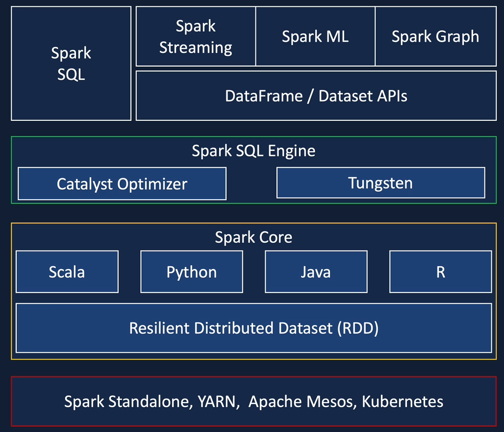

# Databricks
creer par la société de Spark pour facilité l'intégration et l'utilisation de Spark

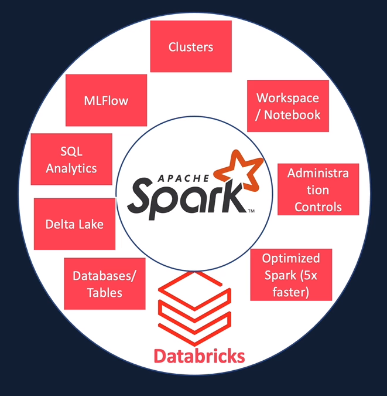

Aussi il faut savoir que Databricks est disponible dans toute les plateforme:
- AWS
- Azure
- Google Cloud

L'intégration sur Azure est plus importante que sur les autres service ( It's a first party service on azure )

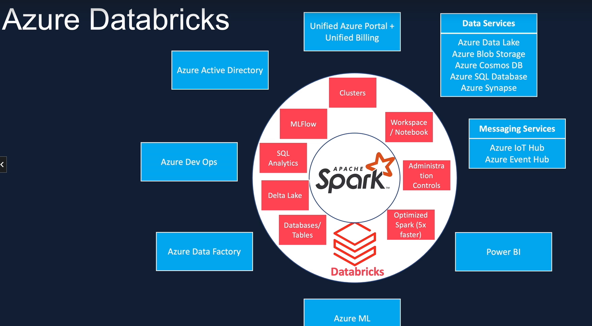

## Azure Databricks Architectures

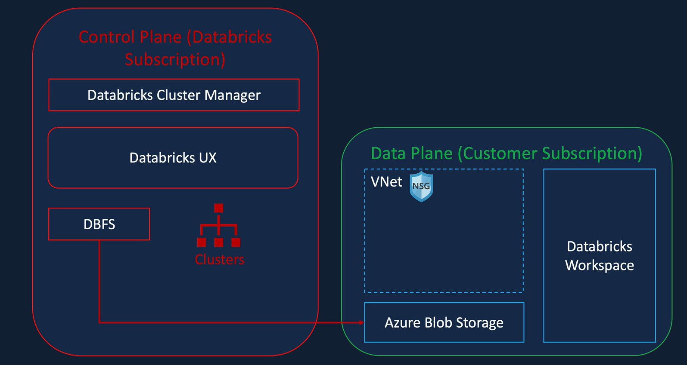

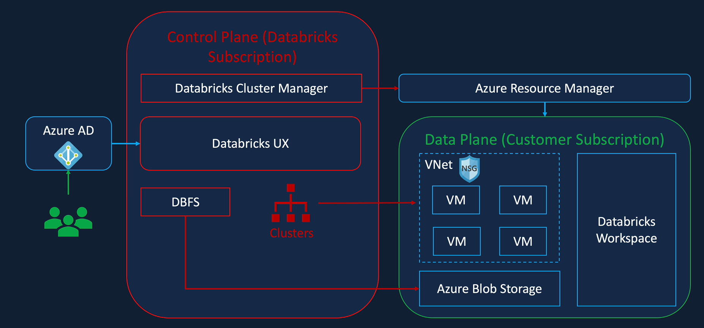

# Cluster configuration

## Cluster mode

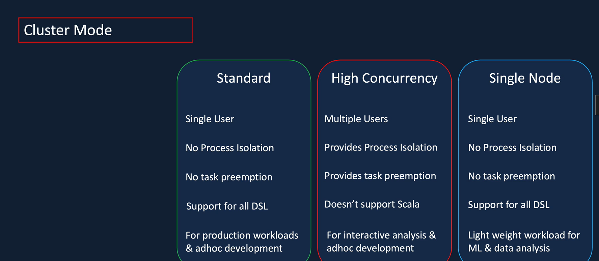

## Datavricks rutime

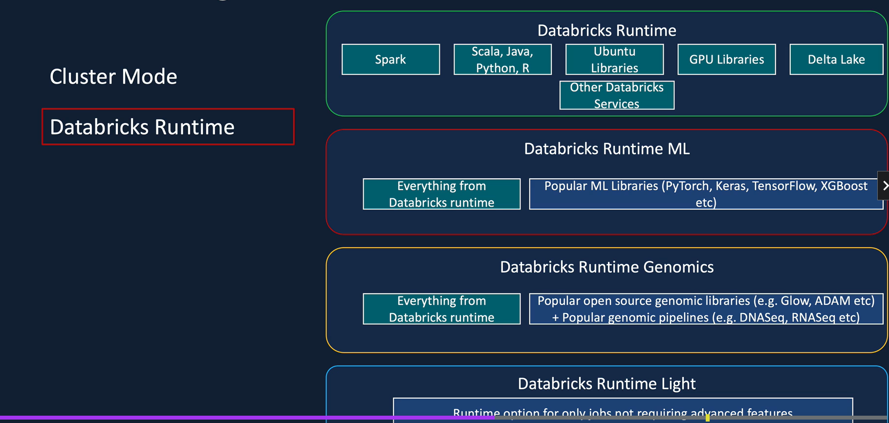

## Auto termination 

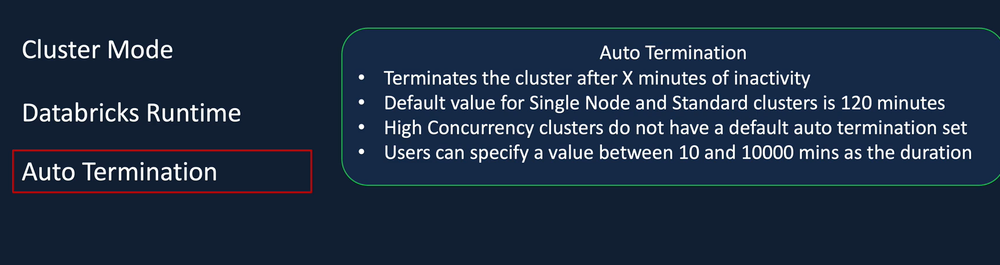

## Auto scalling

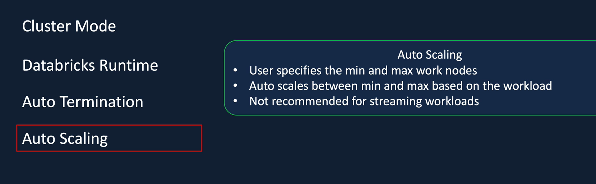

## Cluster VM Type / Size

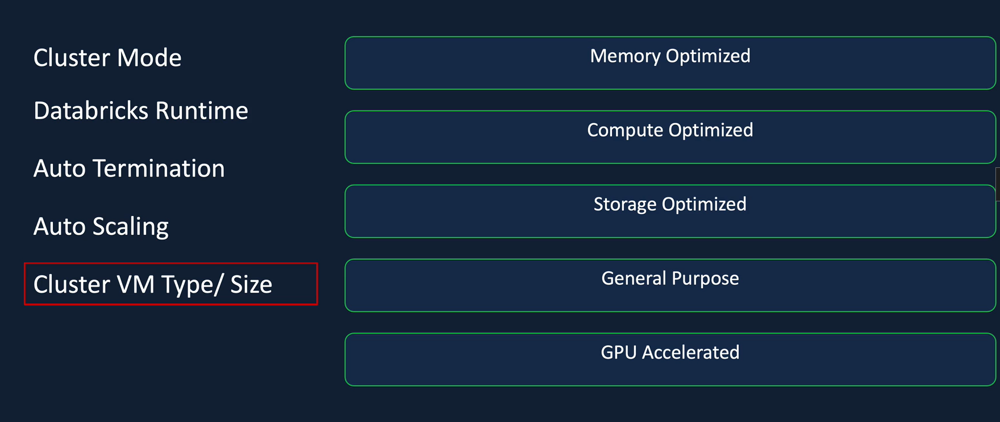

## Cluster pool

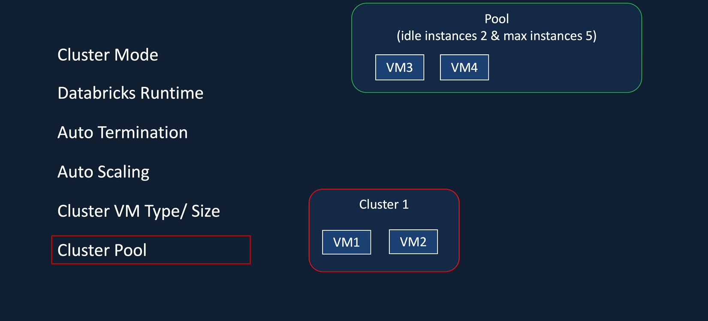

Pour la minimum IDLE meme si on spécifie l'**auto termination** elle continuera à tourner et à a consommer des **DBU**

# Databricks Notebooks
Dans cet partie on va voir les differente section 
- What's a Notebook
- Creating a Notebook
- Magic commands
- Databricks utilities

## Magic commands
- %sql pour executer du sql 
- %scala pour faire du scala
- %md pour utiliser les markdown
- %fs pour utiliser le **File system**; par exemple ls pour afficher les listes dbfs
- %sh pour executer des commandes shell: par exmple **ps** pour lister les process en cours

## Databricks utilities
- file system utilities: access Databricks file system
- Notebook Workflow utilities: appeler un notebook depuis un autre et les enchainer
- Widget utilities: gives more access for example a data factory pipeline parameters to the notebook
- Secrets utilities: access secret values 
- Library utilities: pour installer des package dans le scope du notebook ( deprecated on utilise a ça place %pip )

