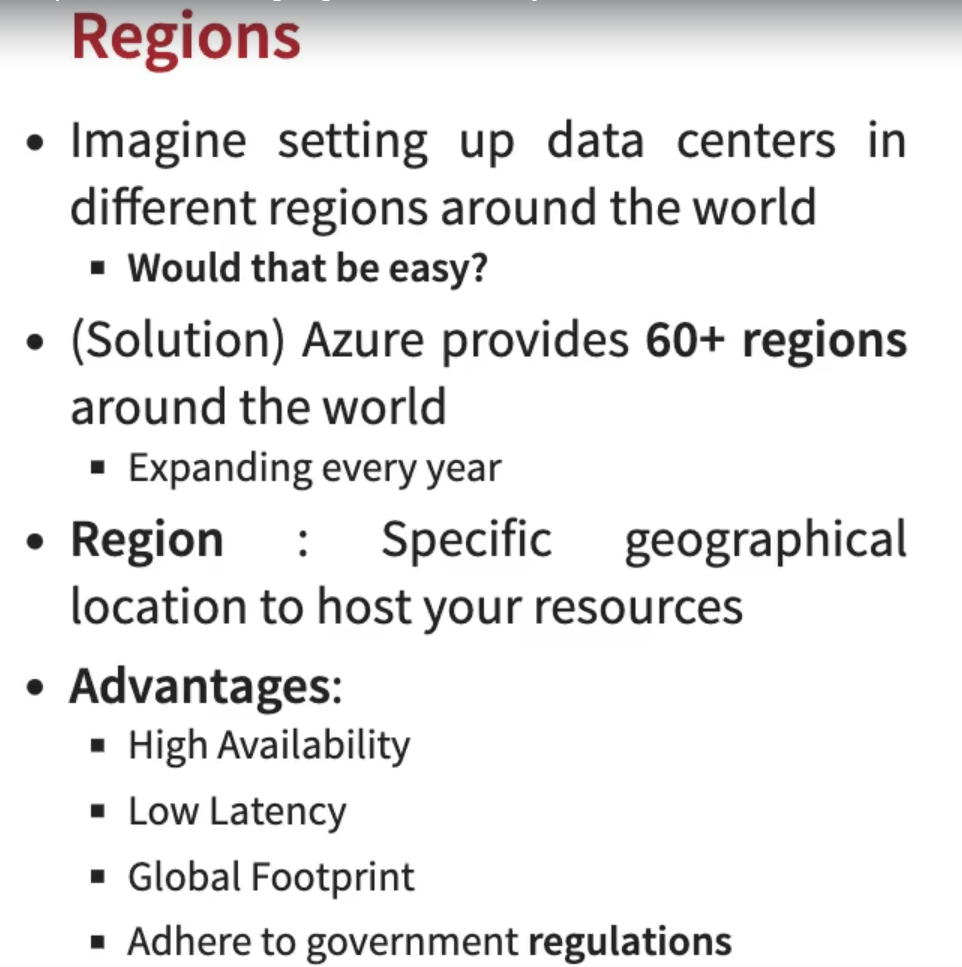

# Exploring Microsoft Azure Fundamentals - Regions and Availability Zones

## Regions and Zones

- Problematic
  - imagine that your application is deployed in a data center in london
  - What would be chalenges
    - 1: Slow access for users from other parts of the world
    - 2: what if the data center crashes
      - your app goes offline
- Solutions
  - Let's add another data center in london
  - 1: The same problem with access from other parts of the world
  - 2: (solved) the second point is resolved
  - Now let's add another data center in Mumbai and that solves the all of our problems

