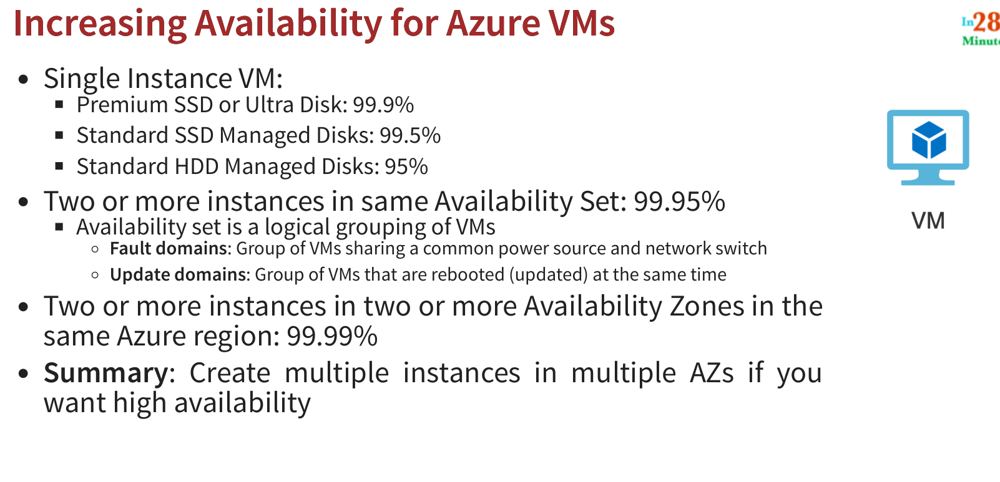

# Exploring Microsoft Azure Fundamentals - AZ Virtual Machines

## What can you do 

- Create and manage lifecycle of VM
- Load balaning and auto scale
- Attach storage to VM instances
- Manage network connectivity and configuration

## Create first VM

We create a simple server with one vcore and 1 GB or RAM, also give access from ssh and port 80 ( HTTP ) 

### Some commands to execute
```sh
chmod 400 my-first-vm_key.pem
ssh -i YOUR_KEY_PATH azureuser@PUBLIC_IP_ADDRESS
ssh -i my-first-vm_key.pem azureuser@13.90.35.80
 
apt-get -y update
apt-get -y install nginx
 
echo "Hello World"
echo "Hello World" > /var/www/html/index.html
echo "Hello World from in28minutes" > /var/www/html/index.html
 
hostname
echo "$(hostname)"
echo "Hello World from $(hostname)"
echo "Hello World from $(hostname)" > /var/www/html/index.html
```

## Cloud Init Script

```sh
#!/bin/sh
sudo su
apt-get -y update
apt-get -y install nginx
echo "Welcome to in28minutes $(hostname)" > /var/www/html/index.html
```


